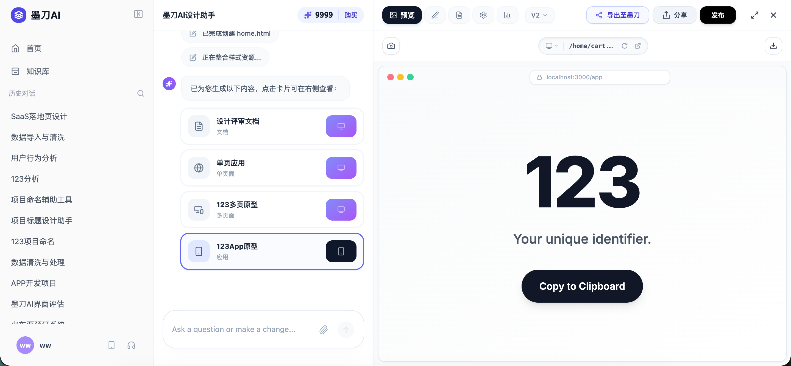
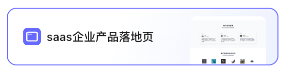
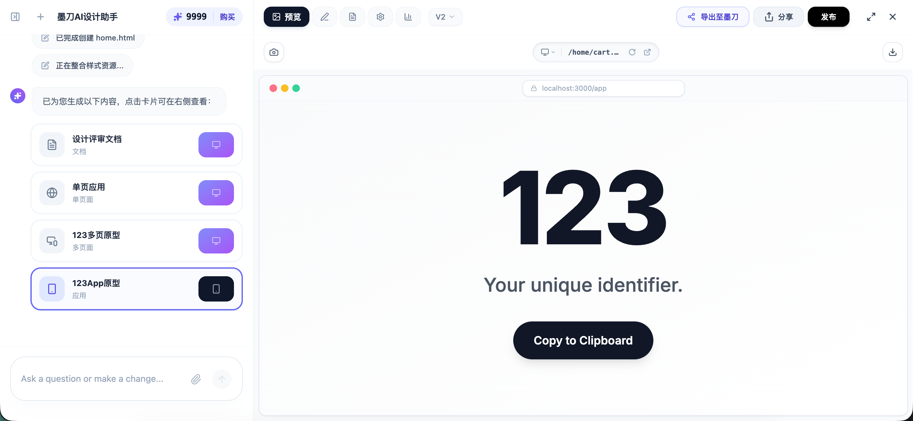
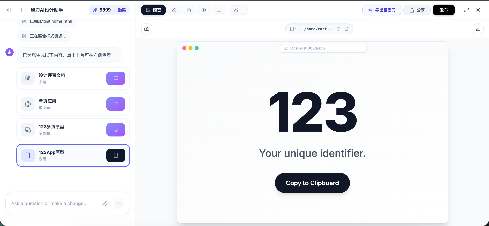
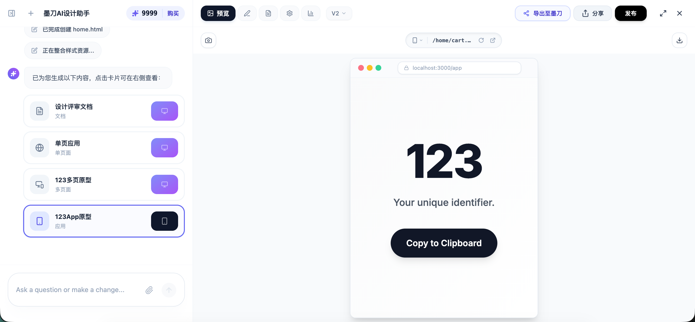
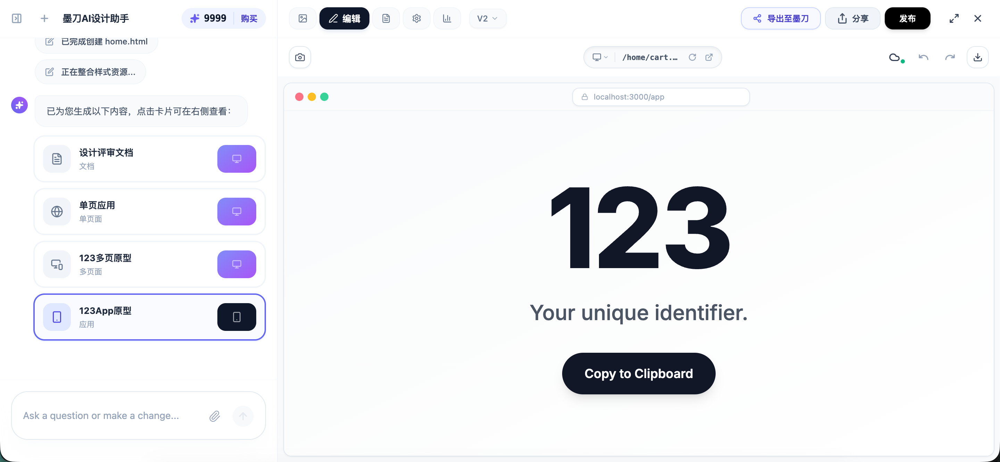
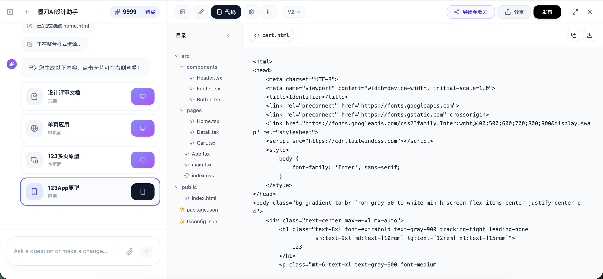
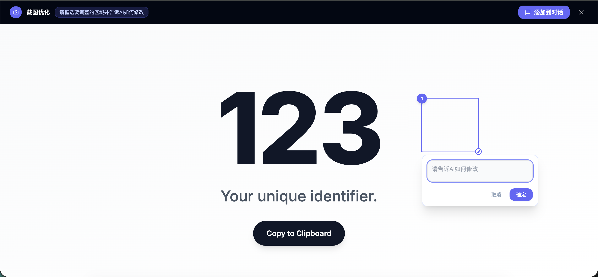
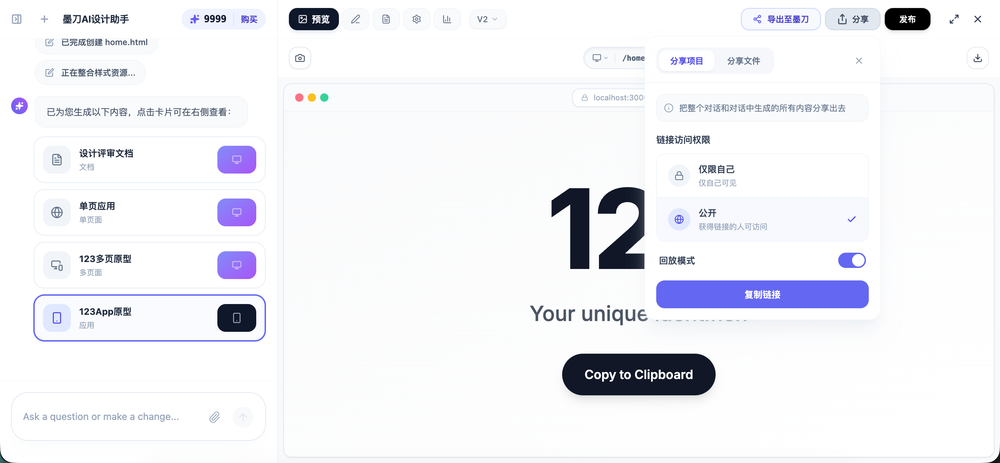
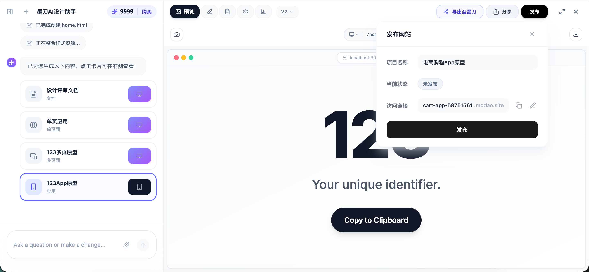

# 墨刀 AI-D2D 端到端应用生成 PRD

> **文档性质**：面向 UI 设计、研发、测试的执行级规格文档。
> **配套文档**：商业背景与产品策略请参阅 [《BRD.md》](./BRD.md)。

---

## 第一部分 综述

### 1、版本记录

| 版本号 | 修改日期 | 修改人 | 修改内容摘要 |
| --- | --- | --- | --- |
| V1.0 | 2026-03-10 | ww | 初版，按 PRD 规范模板全面梳理 |

---

### 2、背景介绍

#### 1）业务背景

墨刀端到端（D2D）旨在成为"从想法到产品"的最短路径平台。在既有墨刀AI的基础上，打通"对话 → 可运行代码 → 公网应用"的端到端闭环。用户无需任何编码能力，即可直接获得包含真实技术栈的前后端应用。

#### 2）目标用户

| 用户类型 | 核心需求 | 典型场景 |
| --- | --- | --- |
| **独立业务方** | **MVP 低成本试错**：跳过开发环节，直接生成生产力工具并发布验证。 | 个人主创通过对话 1 小时上线一个 A 股分析小工具并开启推广。 |
| **产品专家** | **交互规格定义**：用“活的应用”代替“死文档”，实现规格的自动化定义。 | PM 生成一个复杂的管理后台框架，直接交接代码给前端研发。 |
| **方案顾问** | **即时方案交付**：利用对话生成极具视觉冲击力的现场 Demo 提升转化率。 | 售前在演示现场根据客户随口提的需求，当场生成并发布预览链接。 |


#### 3）业务目标

- **交付提效（超速 MVP）**：实现从“对话意图”到“可部署应用”的极速转化，将开发周期从周级缩短至分钟级，实现**业务验证零门槛**。
- **规格革命（定义即代码）**：用“可运行应用”替代“静态文档”作为产研交接标准，消除理解偏差，实现**需求定义的零歧义**。
- **价值可视化（即时体感）**：通过即时生成的动态 Demo 替代静态 PPT，全方位提升方案说服力，实现**商业场景的即时交付**。

---

### 3、功能范围

本 PRD 涵盖以下 5 大功能模块：

1. **首页输入工作区**：增加生成应用一级类别、一级tab顺序调整、原型设计/营销与多媒体tab下增加内容、生成应用的输入框调整
2. **生成工作台（D2D Studio）**：顶部栏功能布局调整、预览应用、可视化局部编辑、代码查看器
3. **截图优化工具**：截图入口、标注编辑、插入对话
4. **发布与分发中心**：域名配置、一键部署
5. **问询/追问模式**：上下文追问、生成参数微调

**本期不包含**：配置、分析tab的功能暂时不做。

---

### 4、术语表

| 术语 | 定义 |
| --- | --- |
| **会话（Session）** | 用户与 AI 进行的一次连贯对话生命周期，包含完整的输入-生成历史 |
| **流式生成（Streaming）** | AI 模型分批次、逐步输出代码的推流过程，区别于一次性返回 |
| **预览沙盒（Preview Sandbox）** | 用于隔离运行 AI 生成 HTML 的 iframe 容器，启用 sandbox 安全属性 |
| **画幅切片** | 局部编辑模式下，用户在预览区框选的特定坐标区域图像 |
| **栈（History Stack）** | 记录用户可撤销的操作历史，最大深度 50 步 |
| **二级域名** | 发布时配置的形如 `modao.cc/app/xxx` 的唯一标识 |

---

### 5、全局交互与 UI 规范

以下规范适用于本 PRD 中所有页面和组件：

#### 全局反馈规范

- **Hover 态**：所有可点击元素必须有明确的亮度/颜色变化反馈，鼠标变为 `pointer`，并显示对应的tooltip
- **Loading 态**：超过 300ms 的异步操作必须展示骨架屏或 Spinner，禁止空白等待
- **Toast 通知**：操作成功/失败均使用屏幕中上位置弹出的 Toast，存续时间 2-3 秒后自动消失
- **错误态**：输入类错误在输入框下方红字提示，不使用弹窗打断流程

**键盘快捷键规范**
- `Enter`：发送指令
- `Shift + Enter`：文本域内换行
- `Cmd/Ctrl + Z`：撤销上一步操作
- `Esc`：退出当前选中状态或关闭弹层

---

## 第二部分 信息架构和使用流程

### 1、信息架构

- **墨刀 D2D 工作区**
  - **首页**
    - 输入框
      - 技术栈配置（UI库/主题）
    - AI能力（分类展示，选中后输入框显示对应标签或新tab打开）
      - 推荐
        - 生成Web应用
        - AI生成原型
        - 图片转原型
        - 需求文档PRD
        - HTML转原型
        - 生成图片
      - 生成应用
        - 生成Web应用
        - 生成App应用
      - 原型设计
        - AI生成原型
        - 图片转原型
        - HTML转原型
        - 生成原型概念图
        - 功能交互文档
        - UI规范评审
      - 产品策划
        - 需求文档PRD
        - 竞品分析
        - 用户调研
        - 产品方案评审
        - 产品规划
      - PPT
        - AI生成PPT
        - AI美化PPT
      - 图表与图片
        - 生成图片
        - 流程图
        - 思维导图
        - 用户旅程图
      - 研发测试
        - 测试用例生成
        - 技术方案生成
        - 技术方案评估
      - 营销与多媒体
        - 生成视频
        - 生成营销图
        - SEO文章生成
  - **对话生成区**
    - **左侧：历史对话区**
      - 顶部栏（标题、积分）
      - 对话消息流
      - 底部输入框
    - **右侧：生成的html/应用展示区**
      - 预览tab
        - 截图优化、复制、下载、右侧目录（单html不显示）、应用界面预览
      - 编辑tab
        - 截图优化、撤销/重做、右侧目录（单html不显示）、应用界面可视化编辑
      - 代码tab
        - 撤销/重做、目录、代码编辑器
      - 通用能力
        - 导出至墨刀
        - 分享（分享项目、分享文件）
        - 发布（发布配置弹窗）
        - 版本切换（V1/V2下拉切换）
        - 窗口控制（全屏、关闭）
        - 页面地址栏（演示设备切换、刷新、新tab打开）

### 2、使用流程

**主干流程（端到端）**：

```
① 意图输入
   用户在首页底端选择框架/主题，
   可选上传参考图片，输入自然语言描述
        ↓
② 流式生成渲染
   右侧预览tab下展示 Loading 生成动画
   AI 模型流式输出代码，实时更新预览
        ↓
③ 产品互动验证
   生成就绪，用户在预览tab下直接点击
   体验交互，验证功能与视觉
        ↓
④ 局部迭代（可选）
   不满意时，通过框选局部组件/截图优化进行精准修改，
   或在左侧输入追问进行全局调整
        ↓
⑤ 导出或公网发布
   导出代码：切到代码 Tab 一键复制源码
   发布上线：点击【发布】配置域名上线
```

---

## 第三部分 结构和界面层

### 模块一：首页

#### 1、模块总览

- **入口**：新建项目后的首页
- **权限**：同线上
- **模块内容**：主输入框底部新增设计系统选择和主题色选择菜单，输入框新增一级tab：生成应用，二级tab：生成Web应用、生成App应用

#### 2、对话框与一二级tab

##### 1）界面默认显示（入口展现）


- **基础态**：输入框的样式、文本输入流与文件上传交互，完全**复用线上现有逻辑**。
- **推荐 Tab 更新**：前排新增【生成 Web 应用】与【生成 App 应用】两个高频快捷推荐入口。
- **新增一级tab**：在“推荐” Tab 之后，新增独立的一级分类 **【生成应用】**。选中该分类后，下方展开包含“生成 Web 应用”及“生成 App 应用”的专属二级选项。

##### 2）选中“生成 Web/App 应用”模式后的交互


用户选中某个生成应用tab，界面进入专项工作流，执行以下动态调整：
- **状态胶囊灯**：输入框左上角亮起所选模式的胶囊标签（如“生成 Web 应用”）。点击该标签的叉号或外部清空按钮，可直接退出本专项模式，回归默认清空态。
- **专有配置工具弹出**：输入框左下角必定展开专属的高级配置工具栏（紧跟于“极速/深度”算力切换按钮之后）：
  1. **设计系统选择 (Design System)**：
     - 默认选中项为当前生成能力最成熟的架构组件库 `Shadcn UI`。
     - 支持下拉菜单展开更多选项，显示为 `Ant Design`、`Material UI`、`Arco Design`和`TDesign` 等主流前端物料资产库。
  2. **主题色智能配置 (Theme & Color)**：
     - 注意：该面板的形式会依据上一步所选的“设计系统”发生智能级联切换！
     - **若选 `Shadcn UI` 等系统级框架**：下拉提供成套的内置主题预设，包含 `自动` 以及 `蓝`、`绿`、`紫`、`橙`、`黄` 等颜色主题。
     - **若选 `Ant Design` 等组件化框架**：下拉菜单将纵向裂变为上下两栏布局：上半区为单独的外观开关胶囊（亮色 Light / 暗色 Dark）；下半区为纯色系统主色调选择器（提供自动、橙、绿、蓝、红、黄等颜色）。

##### 3）极简的操作隔离兼容
在上述复杂生成模式激活的状态下，输入区域内的**通用成熟体验不变**（包括：直接将本地图片或截图拖拽上传、点击附件 Icon 唤起系统层选取、`Shift + Enter` 换行、回车 `Enter` 直接极速发送指令），**免除新增用户的额外认知负荷**。

### 模块二：对话生成

#### 1、模块总览

- **入口**：用户在首页输入框内发送指令后，进入对话界面，默认收起左侧栏
- **权限**：同线上
- **模块内容**：采用左右分栏布局——左侧为历史对话区（历史导航 + 对话消息流 + 输入框），右侧为单页html/多页html/应用和文档展示区（预览/编辑/代码三大 Tab + 页面目录 + 顶部工具栏）。



#### 2、左侧栏
- **左侧栏收起/展开**：进入对话页后默认收起左侧栏，左侧栏的功能和交互同线上

#### 3、对话消息区

##### 1）顶部栏（标题、积分）。
- **会话标题**：同线上。
- **积分展示**：同线上
- **左侧导航区**：同线上。
- **分享项目**：合并到右侧的分享按钮中

##### 2）对话消息流
- 对话消息流的内容同线上
- 生成结果的类型，在现有的文档、单html、多页面html基础上，增加应用的样式卡片
   

##### 3）底部输入框
- 输入框同线上

#### 3、右侧生成的单页/多页/应用展示区



- 右侧面板 默认激活"预览 Tab"，顶部 Tab 栏从左至右依次为：📷预览、✏️编辑、📄代码、⚙️配置、📊分析；顶部右侧工具栏：🔼导出至墨刀、↑分享、**发布**、⛶全屏、✕关闭。 
- 本期先不做【配置】和【分析】模块


##### 1）预览 Tab



在对话消息区生成应用后，默认选中最新生成的应用。右侧预览tab下显示应用的界面内容，界面可点击交互。预览tab下的功能从左向右依次是截图优化、地址栏、复制和目录
- 生成的应用前端为react框架，生成html单页面和html多页面的代码格式保持现状

**截图优化**：
  - 单页/多页/应用的预览模式均新增截图优化功能，点击截图优化进入全屏的截图优化模式，具体交互见第4条。

**地址栏操作区**：
  - 地址栏操作区包含设备切换、页面地址、刷新和新tab打开等功能。预览单页面、多页面、应用时，地址栏显示的内容一样
  - hover到地址栏区域时，从左到右依次显示 tooltip：“切换设备”、“切换页面”、“刷新”和“新tab打开”

  - *切换设备*
    - 单击切换设备，下拉显示设备列表，用户可以在PC端、Pad端、移动端之间切换（列表从上到下）。
    - 切换设备的默认项根据用户的生成的结果自动判断，不确定时默认选中 PC端；
      - 选中PC端时，下方的整个带有浏览器地址栏外壳的界面宽度撑满显示区域，高度撑满显示区域
      - 选中Pad端时，下方的整个带有浏览器地址栏外壳的界面限定在800px宽，高度撑满显示区域
      - 选中移动端时，下方的整个带有浏览器地址栏外壳的界面限定在390px宽，高度撑满显示区域
    - 切换设备时，界面内容根据显示区域的宽度自适应变化，高度保持撑满。切换到移动端、Pad端时，界面宽度之外的区域显示背景色，与界面之内的颜色做区分。
   

  - *地址栏*
    - 地址栏中部显示当前正在预览的页面的名称（如 `/home/cart...`），同右侧目录中的页面名称；每次生成后页面默认显示首页的名称
    - 地址栏内的页面名称最多显示10个字符，超出10个字符后显示...
    - 单击地址栏的路由，下拉显示所有的页面，用户可以切换页面（生成的为单页面时，点击地址栏下拉菜单只显示一个页面选项）

  - *刷新和新Tab打开*
    - 点击刷新，刷新当前预览的页面，页面恢复到默认的交互状态。刷新时不切换到其他页面
    - 单击“新tab打开”按钮，在新tab中显示当前预览的界面。
      - 新tab打开时，在浏览器窗口中自适应显示，不按预览时所切换的设备类型显示

**下载**：
  - hover到下载按钮时，显示tooltip：下载代码
  - 位置从顶栏下移一级
    - 预览生成的单页面/多页面时，hover到下载代码按钮时，显示下拉菜单，下载功能同线上
    - 预览生成的应用时，下载按钮没有下拉菜单，点击下载按钮，可将整个项目的代码全部打包下载，zip包形式，功能同线上多页面的下载所有文件的功能

**目录** ：
  - 预览单页面时，不显示目录，同线上；
  - 预览多页面时，显示目录区域，同线上；
  - 预览生成的应用时，不显示左侧目录区域

##### 2）编辑 Tab



切换到编辑模式后，显示的页面同预览tab下的页面，在页面内选择元素即可进行编辑。编辑模式下的工具栏有调整，具体如图所示
- 生成单页/多页后的可视化编辑交互同线上，撤销/重做/保存逻辑均复用线上逻辑
- 生成应用后，在编辑模式下用户可对当前显示的页面进行可视化编辑，可视化编辑交互同线上单页/多页的交互

**截图优化**：
  - 单页/多页/应用的编辑模式下，均支持截图优化，点击截图优化进入全屏的截图优化模式，具体交互见第4条

**地址栏**：
  - 单页/多页/应用的编辑模式下，地址栏的功能和交互同预览tab下的地址栏

**目录** ：
  - 编辑单页面时，不显示目录，同线上；
  - 编辑多页面时，显示目录区域，同线上；
  - 编辑生成的应用时，不显示左侧目录区域

**下载**：
  - hover到下载按钮时，显示tooltip：下载代码
  - 位置从顶栏下移一级
    - 编辑生成的单页面/多页面时，hover到下载代码按钮时，显示下拉菜单，下载功能同线上
    - 编辑生成的应用时，下载按钮没有下拉菜单，点击下载按钮，可将整个项目的代码全部打包下载，zip包形式，功能同线上多页面的下载所有文件的功能
  
##### 3）代码 Tab



切换到代码页面后，默认显示预览、编辑模式下所显示的页面代码。页面布局上，将下载功能从一级tab栏下移一层，且在选中目录中的某个页面时，顶栏显示对应的页面名称
- 单页、多页保留现有的html格式
- 生成的应用默认采用react框架，代码显示区的展示样式同线上单页/多页的展示样式。

**下载**：
  - hover到下载按钮时，显示tooltip：下载代码
  - 单页、多页的代码模式下，下载功能同线上。
  - 应用的代码模式下，hover到下载按钮显示下拉菜单，下拉菜单选项为下载当前文件和下载所有文件（下拉菜单内容同多页的下载）
    - 点击下载当前文件，只现在当前所查看的问题
    - 点击下载所有文件，可将整个项目的代码全部打包下载，zip包形式，功能同线上多页面打包下载

**复制**：
  - hover到复制按钮时，显示tooltip：复制代码
  - 查看单页、多页的代码时，复制功能同线上。
  - 查看应用到代码时，单击复制按钮，可将当前所打开的文件页面内的代码全部复制到剪贴板，功能同线上单页/多页的代码复制

**目录**：
  - 单页、多页的代码模式下，目录的布局和交互同线上
  - 应用的代码模式下，左侧有代码目录，按照项目文件从上向下展示

  - **展示逻辑**：
    - 应用代码模式下，左侧目录采用多层级树状结构（Tree View），深度与项目实际文件层级保持一致。
  - **文件夹交互**：
    - 前端不展示文件夹图标。仅保留左侧的展开/收起箭头（Chevron）；
    - 点击文件夹行任何区域，可切换其"展开/收起"状态；
    - 带有方向指示箭头：展开时箭头向下，收起时箭头向右。
  - **文件交互**：
    - 点击文件行，右侧代码区域立即加载并展示该文件代码内容；
    - 当前选中的文件行背景呈现高亮状态（Active State），且顶栏文件名同步更新；
  - **文件图标分类显示逻辑**（参考 Lovable 简约风格，按大类映射统一图标）：
    - **逻辑与组件类** (`React/Logic`)：
      - 覆盖：`.tsx`, `.jsx`, `.ts`, `.js`, `.mjs`, `.cjs` 以及 `route.ts/js`。
      - 图标：统一使用 React 原子图标（或代码 `</>` 图标），强调核心逻辑。
    - **样式类** (`Styles`)：
      - 覆盖：`.css`, `.scss`, `.sass`, `.less` 以及 `.module.*` 后缀。
      - 图标：统一使用样式图标（如 # 号或调色盘），区分样式修饰。
    - **配置与数据类** (`Config/Data`)：
      - 覆盖：`.json`, `.yaml`, `.yml`, `.env*`, `.prisma`, `.sql`, `.gitignore` 以及各类 `.config.*` 文件。
      - 图标：统一使用设置图标（齿轮）或数据库图标，标识项目配置与底层定义。
    - **多媒体资源类** (`Assets`)：
      - 覆盖：`.png`, `.jpg`, `.svg`, `.webp`, `.ico`, `.gif`。
      - 图标：统一使用图片/画框图标，标识视觉素材。
    - **文档类** (`Docs`)：
      - 覆盖：`.md`, `.mdx`, `.pdf`, `.txt`。
      - 图标：统一使用文档/纸张图标，标识说明文件。
  - **视觉样式与极致缩进处理**：
    - 每一级子目录向右缩进固定距离（建议 12px-16px），增强层级感；
    - **宽度调整策略**：
      1. **可拖拽分割线**：目录区域与右侧代码显示区域之间存在一条垂直分割线，鼠标 hover 到该线上时手势切换为 `col-resize`；
      2. **自由缩放**：用户可通过拖拽分割线自由调整目录区域的宽度。
      3. **尺寸限制**：
         - **最小宽度**：限制在 120px，防止宽度过窄导致内容完全不可见；
         - **最大宽度**：限制在当前应用视图宽度的 40% 或 400px（取小值），确保右侧代码编辑区有足够的操作空间。
      4. **截断逻辑**：当目录层级深度或文件名超出当前设定的区域宽度时，文件名采用末尾省略号截断，hover 时通过 Tooltip 展示完整名称。
    - **非记忆性逻辑**：用户调整目录宽度后，若切换至其他 Tab（如预览或编辑 Tab）再返回，目录宽度将恢复为系统的默认宽度，不保留用户的个性化调整。
    - 鼠标 hover 列表项时，单行显示浅色背景，提升视觉反馈。


##### 4）截图优化



提供对当前生成内容的快速抓取与标注反馈能力，解决文字指令针对视觉细节描述困难的问题。

- **全屏模式交互**：
  - **入口**：点击预览/编辑 Tab 内容区左上角的 📷 **截图优化**图标，进入全屏工作模式。
  - **显示页面**：全屏内展示与预览 Tab 完全一致的生成内容（同一 iframe srcDoc），背景为深色遮罩，内容区域不保留设备外壳，采用 Fluid 布局填充视口，以确保最大标注空间。
  - **显示逻辑**：展示范围同「新 Tab 打开」，内容区域整体禁止文字选中（`user-select: none`），防止框选时出现文字高亮。

- **全屏工具栏 (Top Toolbar)**：
  - 左侧：截图优化图标 + "截图优化"标题 + 提示文字标签（"请框选要调整的区域并告诉AI如何修改"）。
  - 右侧：**添加到对话**（将当前标注信息附加至输入框）+ **关闭**（退出模式，不保存标注）。

- **框选交互**：
  - 在内容区鼠标按下并拖拽，即可绘制矩形选框；选框宽高小于 10px×10px 时不生效。
  - **防文字选中**：整个画布区域设置 `select-none`，框选过程不触发浏览器文字选择。
  - **输入框自适应高度**：输入框默认显示两行高度，随内容输入自动撑高，最高撑至五行后内部显示滚动条。
  - **边界防溢出**：在选框靠近页面上下左右边界时，输入面板会自动调整位置（如向上/向左对齐），确保输入面板不会超出浏览器视口边界。
    - **取消**：直接删除当前选框。
    - **确定**（有内容时）：收起选框与输入框，仅在左上角显示数字徽章；（无内容时）等同于取消，删除选框。
  - **空白处点击行为**：
    - 若当前有编辑中（未确认）的选框且**无内容**：点击画布空白处，该选框消失。
    - 若当前有编辑中的选框且**有内容**：点击画布空白处，触发选框水平抖动动画（0.45s），提醒用户先确认或取消。

- **已确认选框的交互**：
  - **默认态**：仅显示左上角的蓝色数字徽章，框体和文本均隐藏。
  - **Hover 态**：鼠标悬停在数字徽章上时，展开选框蓝色边框。
  - **Active 态**：点击数字徽章后，常显蓝色选框和文本内容弹出框；卡片底部显示「删除」按钮，点击后移除该标注。点击页面空白处，或再次点击该数字徽章，收起弹框。

- **选框拖动**：鼠标悬停在未确认/已确认的选框的框体中心时，光标切换为抓手（`grab`）；按住后可自由拖动整个选框位置。

- **选框调整大小**：未确认选框的右下角显示缩放箭头手柄（`nwse-resize`）；按住并拖动可等比/非等比调整选框的宽高，最小宽度 40px，最小高度 30px。

- **技术规格与异常处理**：
  - **截取预览区**：通过 `html2canvas` 抓取。若遇跨域限制导致 iframe 白屏，Toast 提示："无法截取当前内容，请尝试直接框选屏幕区域或手动粘贴图片"。
  - **长图支持**：页面内容若超过屏幕高度，全屏容器内应支持纵向滚动以查看完整页面并进行局部标注。滚动页面时，批注的层级低于顶部栏层级

##### 5）导出至墨刀
- 单页/多页的导出至墨刀功能同线上。
- 应用的导出至墨刀功能：支持将 React 框架生成的应用，将其各个页面作为一个个单页面的方式导入到原型编辑区。
  - 导入过程的交互和导入后在编辑区的显示格式同单页/多页的导入。
  - 导入后，应用内的各个页面按照应用目录（地址栏顺序/路由层级）的顺序，在画布中从左向右横向排列展示，页面间距 10px。
  - 导入为墨刀原型组件后，支持在墨刀画布内对生成的各个页面进行可视化编辑和交互连线。

##### 6）分享



- **分享入口**：点击顶部"↑ 分享"按钮，在按钮下方以 Popover 形式弹出分享设置面板（`fade-in + slide-in-from-top`），点击面板外部自动关闭。

- **分享粒度**：面板顶部提供两个标签页切换——"分享项目"（全部文件）和"分享文件"（当前单文件），默认选中"分享项目"。切换时下方显示对应说明文字（“把整个对话和对话中生成的所有内容分享出去” / “只分享当前所选的文件”）。切换分享项目和分享文件后的功能同现有线上功能。

##### 7）发布



- **发布入口**：顶部右侧"**发布**"按钮，点击在按钮下方以 Popover 形式弹出发布面板（`fade-in + slide-in-from-top`），点击面板外部自动关闭。
- **发布弹框内容**：
  - 未发布：显示项目名称、发布状态、URL链接和发布按钮
  - 已发布：显示项目名称、发布状态、最近发布、URL链接、撤回和更新按钮
- **表单字段**：
  - **项目名称**：
    - 默认填充当前会话标题，支持修改（长度限制：1-50 个字符）。
    - 文本格式：支持任意语言、符号、数字组合。
    - 超长处理：在非编辑（只读）状态下若超出显示区域（容器定宽），尾部自动截断并显示省略号（`...`）；在编辑状态下不允许输入超过 50 个字符。
    - 内容过滤：需接入平台统一敏感词过滤接口，若包含违规词汇，则在保存时飘红提示"包含敏感词汇，请修改"。
  - **当前状态**：
    - 显示当前发布状态。未发布时显示灰色的"未发布"胶囊；
    - 已发布后显示绿色的"已发布"徽章。
  - **最近发布**：
    - 仅在已发布后显示，格式为"X 天前 · Vn"（n 为版本号，从 V1 开始递增）。
  - **访问链接**：
    - 限制只能使用墨刀的三级域名（格式 `{slug}.modao.site`）。用户不可添加自定义独立域名。
    - 点击链接文本即可直接复制链接。后跟两个操作图标：复制（点击变绿色勾 2s）、编辑。
    - 点击编辑后，原有图标替换为"保存"和"取消"按钮，点击可修改 `{slug}` 部分；域名占用时红字报错"该链接已被占用"。
    - 域名内容规则：前缀只能包含**小写英文字母（a-z）**、**数字（0-9）**和**中划线（-）**，且中划线不能位于首尾。
    - 长度限制：最短 3 个字符，最长 30 个字符。超过 30 个字符时无法继续输入。
    - 敏感词过滤：前缀同样需接入敏感词过滤，含有违规词汇时不允许保存，提示"该链接包含违规字符"。
    - 重名校验：保存时需请求后端校验，若域名已被其他项目占用，则报错"该链接已被占用"。
    
- **底部操作按钮**：
  - **初次发布（未发布态）**：仅显示全宽深色"发布"按钮；点击后按钮进入 Loading 状态（"正在发布..."） → 1.5s 后切换为绿色"发布成功"，同时关闭面板，`isPublished` 置为 true，版本号置 V1。
  - **已发布 + 无变更**：显示"撤回"和禁用态灰色"更新"按钮（`cursor-not-allowed`）；变更判定依据：`projectName` 与发布时快照不一致。若未修改直接再次点击发布入口，只能操作"撤回"。
  - **已发布 + 有变更**：显示"撤回"和激活态深色"更新"按钮；点击"更新"后同样进入 Loading 状态（"正在发布..."） → 绿色"更新成功"，版本号 +1，快照更新。
  - **撤回**：点击后 `isPublished` 置 false，版本号清零，面板关闭。
- **域名规则**：仅英文字母（a-z）、数字（0-9）、横线（-），长度 3-20 位；随机生成按钮可一键生成随机 slug。

##### 8）其他顶部通用功能

**版本切换（V2▼）** ：同线上
**全屏** ：位置移到右侧第二个位置，功能同线上
**关闭** ：同线上

---

#### 4、右侧生成的文档展示区

> 当 AI 生成产物为**文档类内容**（如 PRD、竞品分析、PPT 提纲等结构化文本），右侧自动切换为文档展示模式，而非应用沙盒预览。


##### 1）文档展示区
- **富文本渲染**：将 AI 生成的 Markdown 或结构化文档以富文本形式渲染，支持标题层级、列表、表格、代码块等格式。
- **复制全文**：右上角一键复制全文内容到剪贴板，Toast 提示"复制成功"。
- **下载文档**：支持下载为 `.md` 或 `.txt` 格式文件。
- **目录导航**：右侧目录面板自动解析文档标题层级，点击可快速定位到对应章节。
- **继续追问**：文档类生成同样支持左侧追问，AI 基于已有文档内容进行增量补充或修改，不重置会话。


## 第四部分 非功能性说明

### 1、性能要求

- **首屏加载**：工作台框架（非 AI 内容）首次渲染 < **800ms**（正常网络环境）
- **操作响应**：点击、拖拽等 UI 操作响应延迟 < **100ms**，不得有卡顿感
- **大代码防卡**：生成代码体积 > 2MB 时，代码查看器必须启用虚拟滚动；左侧对话历史超过 50 条时开启虚拟列表

### 2、安全性要求

- **沙盒隔离**：预览 iframe 必须开启 `sandbox="allow-scripts allow-same-origin"`，禁止访问主站 Cookie
- **内容安全**：AI 下发内容需经过后置敏感词检测，触发安全红线时自动替换为风险占位符
- **接口鉴权**：所有 API 请求需携带合法的用户 Token，服务端强制校验，拒绝未授权请求
- **域名防抢占**：发布域名在提交前进行数据库级别的唯一性锁定，防止并发抢注

### 3、兼容性要求

- **浏览器**：支持 Chrome 90+、Safari 14+、Firefox 90+、Edge（Chromium 版）；不承诺兼容 IE11
- **分辨率**：最小支持 **1440×900**，可降级到 1280×800（局部布局可能折叠）
- **设备**：当前版本仅面向桌面端，移动端不在本期范围

### 4、可测试性要求

- 核心操作路径（发送指令→生成→发布）需覆盖端到端冒烟测试
- 关键组件需支持通过 `data-testid` 属性进行 UI 自动化测试定位
- 边界场景（超字数、超大文件、网络断开）需有对应的测试用例

### 5、可扩展性建议

- 技术栈配置项（框架、UI 库）设计为可配置的动态列表，由接口返回，无需发版添加新框架
- 发布域名前缀（当前 `modao.cc/app/`）设计为可配置项，便于私有化部署时替换
- 预留多语言（i18n）接口规范，所有 UI 文案抽取为配置 key，不硬编码

---

## 第五部分 私有化 & 海外版

### 1、私有化

#### 核心诉求

允许企业客户将本功能部署在自己的服务器上，不依赖墨刀公有云。

#### 关键适配项

| 项目 | 适配说明 |
| --- | --- |
| **大模型接入** | 支持配置自定义 LLM 接口地址（如企业私有 OpenAI 兼容接口），替换默认的墨刀 AI 模型调用 |
| **发布域名** | 发布目标域名由客户自行配置，替换 `modao.cc/app/` 前缀 |
| **数据存储** | 生成的代码和会话记录存储于客户自己的数据库，不回传至墨刀服务器 |
| **身份认证** | 对接客户企业的 SSO / LDAP 体系，替换墨刀账号登录 |

### 2、海外版

#### 核心诉求

满足海外用户使用习惯与法规要求。

#### 关键适配项

| 项目 | 适配说明 |
| --- | --- |
| **语言** | UI 全面英文化，AI 生成的代码注释 and 文案默认为英文 |
| **数据合规** | 用户数据需存储于当地合规的云服务商（如 AWS 美区、欧区），满足 GDPR / CCPA 要求 |
| **大模型** | 使用海外可用的 LLM 接口，避免网络访问问题 |
| **计费货币** | 支持美元等非人民币结算方式 |

---

## 第六部分 数据和埋点

### 1、数据埋点

以下事件用于统计 D2D 功能链路漏斗与用户行为分析：

| 事件名 | 触发时机 | 重要参数 | 用途 |
| --- | --- | --- | --- |
| `ai_d2d_prompt_submit` | 用户点击发送或按 Enter | `is_first_submit`（是否首次），`has_image`（是否带图），`framework_type`（框架选择） | 核心使用量打点 |
| `ai_d2d_generation_start` | 后端真实开始流式回吐 | `session_id` | 衡量请求成功率 |
| `ai_d2d_generation_complete` | AI 流式输出完整结束 | `session_id`，`duration_ms`（生成耗时） | 衡量生成成功率和性能 |
| `ai_d2d_local_edit_use` | 局部编辑保存成功 | `edit_type`（面板操作/AI 指令），`element_tag`（如 div/img） | 评估局部编辑功能使用率 |
| `ai_d2d_publish_success` | 发布成功回调后 | `publish_type`（public/link_only/private），`session_id` | 核心项目转化率指标 |
| `ai_d2d_code_copy` | 用户点击代码复制按钮 | `session_id`，`code_size_kb`（代码体积） | 衡量开发者导出使用率 |

### 2、数据统计

**核心看板指标**（供参考，由数据团队负责实现）：

-   **生成漏斗**：`submit` → `generation_start` → `generation_complete` 各步骤转化率
-   **发布转化率**：`generation_complete` → `publish_success` 转化率，核心健康度指标
-   **功能使用分布**：局部编辑 vs. 纯追问比例；代码复制 vs. 发布的选择比例
-   **性能监控**：`duration_ms`（P50/P90/P99 生成耗时分布）
